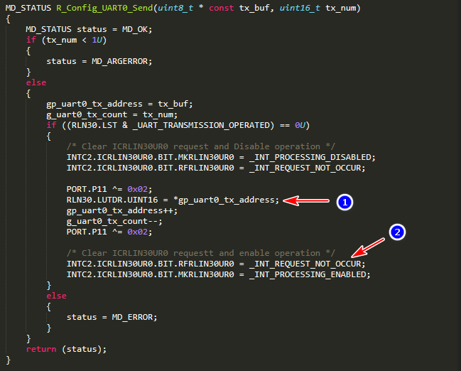

RH850 UART
==========

#### Hardware Connection Layout

* Board: Y-ASK-RH850F1KM-S1-V2

Function    | Signal Name| Pin Name  | F1KM/S1 EVK
------------|------------|-----------|-----------
UART/TX     | RLIN33TX   | P11_5     | J7.15
UART/RX     | RLIN33RX   | P11_6     | J7.16
GPIO        | P0_5       | P0_5      | J3.11
GPIO        | P0_6       | P0_6      | J3.12
Ground      | GND        | GND       | J7.21

* Board: Y-ASK-RH850F1KM-S4-V3

Function    | Signal Name| Pin Name  | F1KM/S1 EVK
------------|------------|-----------|-----------
UART/TX     | RLIN30TX   | P0_2      | J1.18
UART/RX     | RLIN30RX   | P0_3      | J1.19
GPIO        | P11_1      | P11_1     | J1.1
GPIO        | P11_2      | P11_2     | J1.2
Ground      | GND        | GND       | J1.39

#### Baud Rate Calculation
* Reference HWM Section 22.10.3  UART Mode
* UART baud rate = `LINFREQ` x `LPRS_SELCLK` / `BRP01_SETTING` / `NSPB_SEL_CNT`
    - `LINFREQ`: LIN coomunication clock source frequency (CLKSCL_ILIN)
    - `LPRS_SELCLK`: `RLN3nLWBR.LPRS[2:0]` selected clock
    - `BRP01_SETTING`: (`RLN3nLBRP01` + 1)
    - `NSPB_SEL_CNT`: `RLN3nLWBR.NSPB[3:0]` selected count

#### 傳輸速度修改(1Mbps+)，需要修改暫存器設定

##### Source Code (312500 bps, 由 Smart Configurator 產生)

    RLN33.LWBR = _UART_8_SAMPLING | _UART_PRESCALER_CLOCK_SELECT_16;
    RLN33.LBRP01.UINT16 = _UART3_BAUD_RATE_PRESCALER;

    Baud = 40MHz / 16 / (0+1) / 8 = 312,500

##### Modified Code (1M bps)

    RLN33.LWBR = _UART_9_SAMPLING | _UART_PRESCALER_CLOCK_SELECT_4;
    RLN33.LBRP01.UINT16 = _UART3_BAUD_RATE_PRESCALER;

    Baud = 40MHz / 4 / (0+1) / 10 = 1,000,000

##### Modified Code (4M bps)

    RLN30.LWBR = _UART_10_SAMPLING | _UART_PRESCALER_CLOCK_SELECT_1;
    RLN30.LBRP01.UINT16 = _UART0_BAUD_RATE_PRESCALER;

    Baud = 40MHz / 1 / (0+1) / 10 = 4,000,000
[RH850_F1KM-S4_UART_BAUD_4Mbps.zip](code/RH850_F1KM-S4_UART_BAUD_4Mbps.zip)
[TEST](code/)

## 問題：傳輸多個位元僅有一個位元輸出
#### 正常流程如下
   
 代表程式送出 UART 時機  
則是觸發傳送中斷，填入下一筆資料

##### 傳送副程式

    MD_STATUS R_Config_UART0_Send(uint8_t * const tx_buf, uint16_t tx_num)
    {
        MD_STATUS status = MD_OK;
        if (tx_num < 1U)
        {
            status = MD_ARGERROR;
        }
        else
        {
            gp_uart0_tx_address = tx_buf;
            g_uart0_tx_count = tx_num;
            if ((RLN30.LST & _UART_TRANSMISSION_OPERATED) == 0U)
            {
                /* Clear ICRLIN30UR0 request and Disable operation */
                INTC2.ICRLIN30UR0.BIT.MKRLIN30UR0 = _INT_PROCESSING_DISABLED;
                INTC2.ICRLIN30UR0.BIT.RFRLIN30UR0 = _INT_REQUEST_NOT_OCCUR;
                
                PORT.P11 ^= 0x02;
                RLN30.LUTDR.UINT16 = *gp_uart0_tx_address;
                gp_uart0_tx_address++;
                g_uart0_tx_count--;
                PORT.P11 ^= 0x02;

                /* Clear ICRLIN30UR0 requestt and enable operation */
                INTC2.ICRLIN30UR0.BIT.RFRLIN30UR0 = _INT_REQUEST_NOT_OCCUR;
                INTC2.ICRLIN30UR0.BIT.MKRLIN30UR0 = _INT_PROCESSING_ENABLED;
            }
            else
            {
                status = MD_ERROR;
            }
        }
        return (status);
    }

#### 異常波形如下
   

以下為異常發生的原因   
   
資料填入LUTDR，準備送出   
清除中斷旗標及解除遮罩   
在資料填入、移至位移暫存器後，即觸發中斷，這時間非常的短。   
因中斷還沒啟用，所以無法觸發下個位元，造成只有第一個位元被送出。

#### 解決方式
將啟用/停用 MASK 的程式碼移除

    MD_STATUS R_Config_UART0_Send(uint8_t * const tx_buf, uint16_t tx_num)
    {
        MD_STATUS status = MD_OK;
        if (tx_num < 1U)
        {
            status = MD_ARGERROR;
        }
        else
        {
            gp_uart0_tx_address = tx_buf;
            g_uart0_tx_count = tx_num;
            if ((RLN30.LST & _UART_TRANSMISSION_OPERATED) == 0U)
            {
                /* Clear ICRLIN30UR0 request and Disable operation */
                // INTC2.ICRLIN30UR0.BIT.MKRLIN30UR0 = _INT_PROCESSING_DISABLED;
                INTC2.ICRLIN30UR0.BIT.RFRLIN30UR0 = _INT_REQUEST_NOT_OCCUR;
    
                PORT.P11 ^= 0x02;
                RLN30.LUTDR.UINT16 = *gp_uart0_tx_address;
                gp_uart0_tx_address++;
                g_uart0_tx_count--;
                PORT.P11 ^= 0x02;
    
                /* Clear ICRLIN30UR0 requestt and enable operation */
                INTC2.ICRLIN30UR0.BIT.RFRLIN30UR0 = _INT_REQUEST_NOT_OCCUR;
                // INTC2.ICRLIN30UR0.BIT.MKRLIN30UR0 = _INT_PROCESSING_ENABLED;
            }
            else
            {
                status = MD_ERROR;
            }
        }
        return (status);
    }

## 附錄

